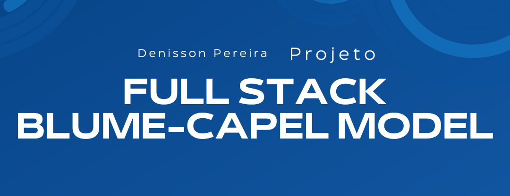
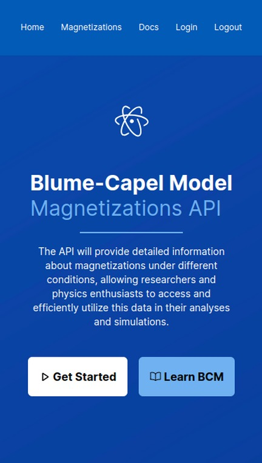

 

<p align="center">
  <a href="https://github.com/DenissonPereira/full-stack-blume-capel-model-"></a>
  <a href="https://github.com/DenissonPereira/full-stack-blume-capel-model-/issues"></a>
  <a href="https://github.com/DenissonPereira/full-stack-blume-capel-model-/graphs/contributors"></a>
  <a href="https://github.com/DenissonPereira/full-stack-blume-capel-model-/commits/main"></a>
  <a href="https://github.com/DenissonPereira/full-stack-blume-capel-model-/stargazers"></a>
</p>


# 📑 Sobre o projeto 


Dentro da teoria do campo médio, o **modelo de Blume-Capel** destaca-se no estudo de sistemas de spins mistos. No entanto, sua solução não é trivial, pois envolve sistemas de equações hiperbólicas autoconsistentes. A expressão para o Hamiltoniano do modelo é

<div align='center'> 

</div>

Nessa perspectiva, o presente projeto propõe um conjunto de *softwares* para auxiliar pesquisadores da área com as soluções das equações e outros dados importantes. Com o objetivo de alcançar esse intento, o projeto é composto por três partes fundamentais: **backend**, **web** e **mobile**. O **backend**, desenvolvido em **Java**, oferece uma **API** com dados persistentes do banco, permitindo aos usuários consumi-los sem a necessidade de resolver equações, proporcionando assim a continuidade de suas pesquisas de forma eficiente. A parte **web**, criada com **React**, disponibiliza uma plataforma que consome a **API** e também permite a modificação dos dados, especialmente quando o usuário possui privilégios de administrador. Já a parte **mobile**, elaborada com **React Native**, oferece uma interface elegante e de fácil uso, possibilitando um acesso rápido e intuitivo aos dados necessários.


## 📚 Stack Tecnológica


### • Design


### • Backend

[](https://www.java.com/)

[](https://spring.io/)


### • Web


### • Mobile


# ⚙ Pré-requisitos

## Certifique-se de ter o Node.js instalado

Antes de mais nada, verifique se você tem o Node.js instalado em sua máquina. Você pode baixá-lo e instalá-lo a partir do site oficial do Node.js:

[](https://nodejs.org/en) 

## Instale o Expo CLI globalmente

Abra o terminal ou prompt de comando e execute o seguinte comando para instalar o Expo CLI globalmente em sua máquina:

```
npm install -g expo-cli
```

# 🚀 Como executar o projeto 🚀

## ⬇️ Clonar repositório git

```
git clone https://github.com/DenissonPereira/full-stack-blume-capel-model-
```

## 🏧 Backend

Após clonar o repositório, para acessar o backend, basta digitar o seguinte comando no terminal:

```
cd backend
```

Lembre-se de que os dados estão localizados, a partir da raiz do projeto, em database/Dump20240319.sql

## 🌐 Web

Para acessar a interface web, na pasta raiz do projeto, basta digitar:

```
cd web
```

Após entrar na pasta, instale as dependências do projeto com o seguinte comando:

```
npm install 
```


Assim, para iniciar a aplicação, digite o seguinte comando no terminal:

```
npm run dev
```

Por fim, você pode acessar a aplicação em seu navegador de preferência utilizando o seguinte endereço: http://localhost:3000/

## 📱 Mobile

Para acessar a pasta do projeto, digite no terminal o seguinte comando:

```
cd mobile
```

Após entrar na pasta, instale as dependências do projeto com o seguinte comando:

```
npm install 
```

Tudo pronto! para visualizar o projeto, digite:

```
npx expo
```


# 📸 Visuals and Screenshots

Dê uma espiada no nosso projeto em funcionamento e esclareça todas as suas dúvidas sobre como executá-lo!

## 🌐 Web

### Versão web

 

## 📱 Responsividade e Mobile

  

## 📺 Editor de código

Neste projeto, foi utilizado o Visual Studio Code como editor de código.

[](https://code.visualstudio.com/)


# 🚨 Aguarde! Ainda não terminou!

>Este projeto está atualmente em desenvolvimento, e está sujeito a futuras atualizações e melhorias conforme evolui. Estamos trabalhando para torná-lo ainda mais robusto e funcional ao longo do tempo. Agradecemos sua paciência e interesse nesta fase inicial.

>Além disso, gostaríamos de ressaltar que este projeto é aberto a contribuições de qualquer pessoa interessada em colaborar. Se você tem ideias, sugestões ou melhorias para oferecer, sinta-se à vontade para participar do desenvolvimento do projeto. Juntos, podemos criar algo incrível e beneficiar a comunidade de forma colaborativa.

## 📜 Licença

[](https://github.com/DenissonPereira/full-stack-blume-capel-model-/blob/main/LICENSE) 

## ✏️ Autor 

Denisson Pereira Santos

<div align='center'> 
<a href="https://www.linkedin.com/in/denisson-pereira" target="_blank"></a> 
<a href="https://denissonpereira.com" target="_blank"></a> 
<a href="https://github.com/DenissonPereira" target="_blank"></a> 
<a href="https://www.instagram.com/denisson_pereira1?igshid=OGQ5ZDc2ODk2ZA%3D%3D&utm_source=qr" target="_blank"></a>
</div>&nbsp;&nbsp;